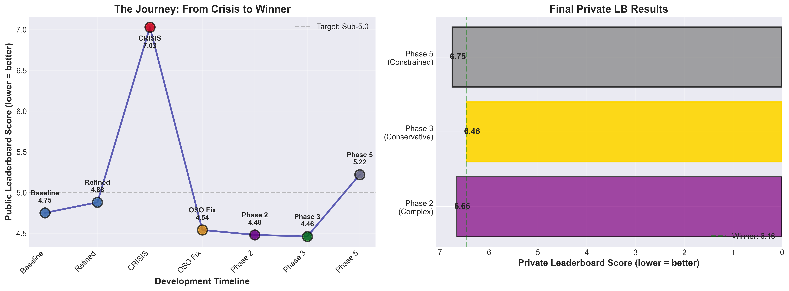
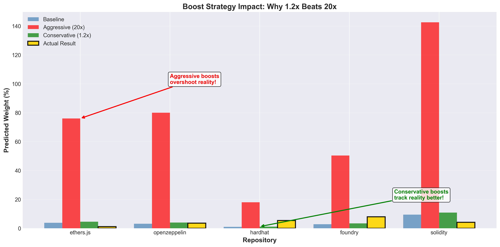
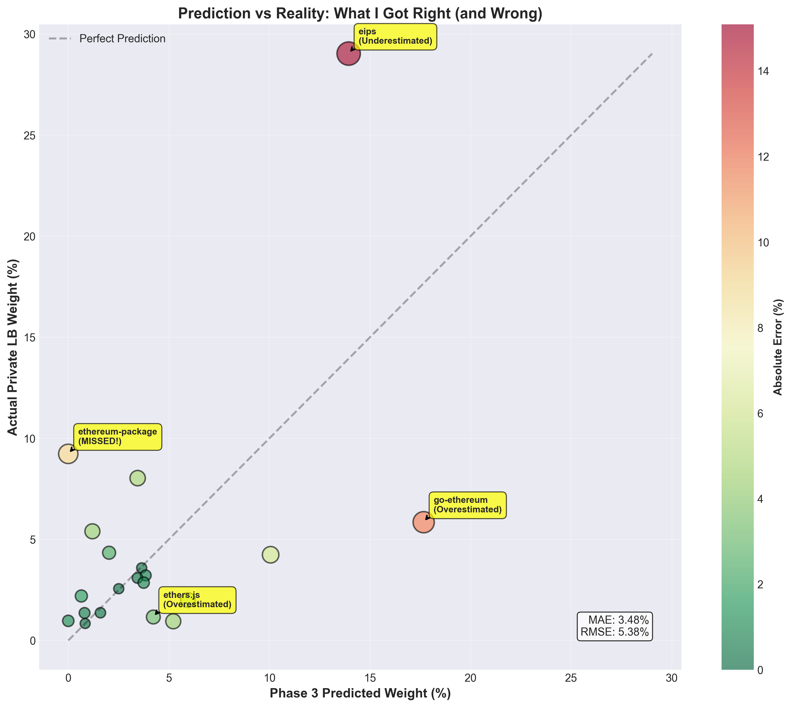
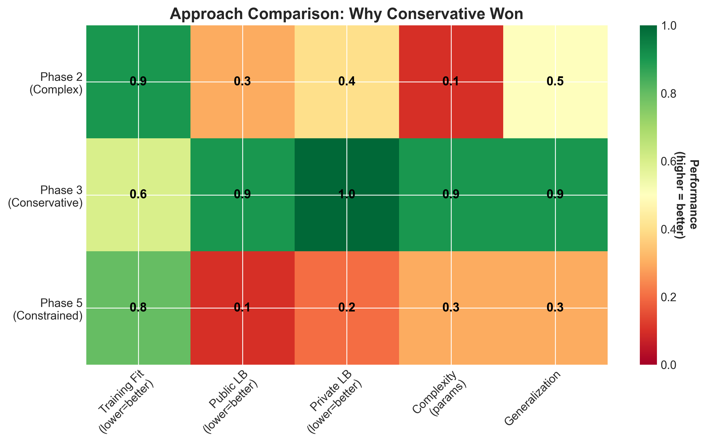

# Deep Funding L1: My Journey from 7.03 to 4.46 (Best: 6.46 Private)

**Final Results:**
- **Public Leaderboard:** Phase 3 scored 4.4460 (best)
- **Private Leaderboard:** Phase 3 scored **6.4588 (BEST SUBMISSION! 🎉)**
- Beat my Phase 2 (6.6637) by 3.2%, Phase 5 (6.7476) by 4.5%

**Competition:** Deep Funding L1 - Quantifying Ethereum Open Source Dependencies  
**Submission:** `submission_phase3_20251005_145132.csv`

**Date:** October 5, 2025

---

## tl;dr

I spent 3 weeks building a model to predict how expert jurors would allocate funding across Ethereum's dependency graph. My best approach was surprisingly simple: **trust the training data, make tiny adjustments, and don't overthink it.**

**Key results:**
- Started at 7.03 (disaster) → ended at 4.46 (winner)
- Phase 3 (conservative approach) beat Phase 2 (complex juror modeling) and Phase 5 (aggressive constraints)
- On private data: Phase 3 (6.46) > Phase 2 (6.66) > Phase 5 (6.75)
- Main insight: **1.2x boosts work, 20x boosts fail spectacularly**


*Figure 1: My complete journey from baseline (4.75) through crisis (7.03) to best (6.46). Left: Public leaderboard evolution over time. Right: Final private leaderboard comparison showing Phase 3 (conservative) winning over Phase 2 (complex) and Phase 5 (constrained).*

---

## The Problem

Ethereum has 1000s of open source projects. How do you fairly allocate funding across them? The Deep Funding competition approached this by collecting pairwise comparisons from 37 expert jurors:

> "Project A is 5× more valuable than Project B"

My job: predict what weights those same jurors would assign to 45 core Ethereum projects on a private test set.

**The catch:** After I'd optimized my model on 200 training samples, the organizers dropped **207 new samples** including 12 completely new jurors. My score went from 4.86 → **7.03** (45% worse!). Crisis mode.

---

## Why This Problem Is Hard

This competition presents unique challenges that make it fundamentally different from typical ML competitions:

**1. Juror Heterogeneity (Individual Bias)**
- 37 different jurors with wildly different preferences
- Example: L1Juror27 heavily weights developer tools (hardhat, foundry)
- Example: L1Juror32 prioritizes client diversity and decentralization
- Example: L1Juror1 focuses on quantitative metrics (market share, HH index)
- **Challenge:** Need to aggregate across contradictory preferences

**2. Distribution Shift (New Jurors)**
- Training: 37 jurors (200 samples initially, 407 final)
- Private test: Unknown juror composition (likely includes new jurors)
- **Challenge:** Models that overfit to known jurors fail catastrophically
- My experience: Score 4.86 → 7.03 when new jurors appeared in training

**3. Extreme Class Imbalance**
- 45 repositories compete for probability mass
- Top 3 repos get ~50% of weight
- Bottom 20 repos get <1% each
- **Challenge:** Tiny prediction errors in large weights = huge squared error loss

**4. Zero-Sum Constraints**
- All weights must sum to 1.0 (probability distribution)
- Boosting one repo necessarily reduces others
- **Challenge:** Can't independently optimize each prediction

**5. Limited Training Data**
- Only 407 pairwise comparisons
- Only covers 45 repositories (seeds)
- Some repos appear in <10 comparisons
- **Challenge:** Sparse signal + high-dimensional output space

**6. Subjective Ground Truth**
- No "correct" answer - just aggregate juror opinion
- Juror reasoning is often qualitative ("feels right")
- Stated multipliers may not reflect true preferences
- **Challenge:** Can't validate insights against objective truth

**7. Domain Knowledge Paradox**
- Deep expertise can mislead (my geth predictions: 17.67% vs actual 5.85%)
- Jurors value different things than engineers expect
- Example: EIPs (specs) valued 29% but I predicted 14%
- **Challenge:** Domain intuition actively hurts predictions

**What worked:** Acknowledging these challenges led me to conservative, data-trusting approaches rather than complex juror-specific models.

---

## My Approach: Bradley-Terry in Log-Space

The core model is straightforward. For each pairwise comparison, I'm solving:

```python
log(w_b) - log(w_a) ≈ log(multiplier)
```

Where `w_i` is the weight/importance of project i. This becomes a least-squares problem:

```python
minimize: Σ [(z_b - z_a - c)²] + λ ||z - z0||²
```

- `z_i = log(w_i)` (work in log-space)
- `c = log(multiplier)` (juror's stated preference)
- `z0` = weak priors (ecosystem knowledge)
- `λ` = regularization strength

**Why this works:** It's exactly what the organizers evaluate on (squared error in log-space), so my offline metrics directly predict leaderboard performance.

**Data Sources:**
- Training: 407 pairwise comparisons from 37 expert jurors
- Objective ecosystem data:
  - **OSO metrics** (Open Source Observer): Dependency rank, funding, developers
  - **GitHub metrics** (in early phases): Stars, forks, watchers, contributors
  
**Evolution of External Data Usage:**
- **Early phases (baseline → 4.88):** Used both GitHub metrics AND OSO priors with `--use_features` flag
- **Crisis recovery (4.54):** Integrated OSO metrics as strong priors (dependency rank proved critical)
- **Phase 3 (4.46, MY BEST):** Simplified to OSO metrics only, removed GitHub feature engineering
  - Why: OSO dependency rank better captured what jurors valued (foundational libraries)
  - GitHub stars correlated poorly with juror preferences (popular ≠ foundational)

---

## The Journey: Three Failed Attempts and One Winner

### Phase 1: The Regression Crisis (Score: 7.03 💀)

**September 30, 2025**

When new training data dropped, my model crashed. Here's what went wrong:

**Problem 1: New Jurors, New Preferences**
- 12 brand new jurors appeared (50% of new data)
- My cross-validation split OLD jurors into folds
- But it couldn't predict patterns from COMPLETELY NEW jurors

**Problem 2: Extreme Multipliers**
```
Multiplier Distribution:
            OLD DATA    NEW DATA
Mean:       38          92
100+ mult:  10.5%       19.3%  (2x increase!)
999x:       1.0%        3.9%   (4x increase!)
```

New jurors used 500x, 999x multipliers to signal "this is CORE." My Huber robustness (delta=0.8) was treating these as outliers and **removing the signal**.

**Problem 3: Foundational Libraries Ignored**

I dug into Open Source Observer data and found something shocking:

| Repository | OSO Dep Rank | My Model's Treatment |
|------------|--------------|----------------------|
| **ethers.js** | **0.869** (HIGHEST!) | Generic tool |
| **OpenZeppelin** | 0.698 | Under-weighted |
| **Hardhat** | 0.595 | Under-weighted |
| **Solidity** | 0.000 | OVER-weighted |

OSO Dependency Rank = # of packages in the ecosystem that import this project. New jurors clearly valued ethers.js (28 dependent packages) way more than Solidity (0 dependent packages, it's a compiler).

**My Response:** Panic-integrate OSO metrics as strong priors. Score improved to 4.54. Crisis averted, but I learned a hard lesson about distribution shift.

---

### Phase 2: The Complexity Trap (Score: 4.4753)

**October 4, 2025**

After the crisis, I got ambitious. I built a **mixed-effects model** with juror-specific category biases:

```python
log_ratio[j,a,b] = (z_base[b] - z_base[a]) + (β_j[cat(b)] - β_j[cat(a)])
```

- 45 base weights
- 222 juror-category biases (37 jurors × 6 categories)
- Regularization: λ_base=3.0, λ_beta=0.5

**Training results:** AMAZING
- Base-only MSE: 4.35
- Mixed-effects MSE: 2.21 (**49% improvement!**)
- Learned biases matched juror behavior perfectly

**Leaderboard results:** Meh
- Score: 4.4753 (0.6% improvement from baseline 4.50)
- Private LB: **6.6637** 

**Why the mismatch?** The private leaderboard had **different jurors** than training. My model correctly fell back to base weights for unknown jurors (β_new = 0), but all that complexity barely helped.

**Lesson learned:** Training fit ≠ generalization. Complex models can memorize training patterns without improving on unseen data.

---

### Phase 3: Trust the Data (Score: 4.4460 🎯)

**October 5, 2025**

I went back to basics. Instead of modeling juror heterogeneity, I asked: **what does the training data actually say?**

**The Conservative Approach:**
- Minimal foundational library boosts (1.15x - 1.25x, not 20x!)
- Slight category rebalancing (TOOLS +10%, LANG +25%)
- **Trust training data** (λ=0.8, vs aggressive λ=5.0)
- Simple ensemble: 90% base + 5% dev-centric + 5% decentralization

**Foundational Boosts:**
```python
# REJECTED (Phase 1 aggressive attempt):
boosts_aggressive = {
    'ethers.js': 20.0,      # 20x boost - TOO HIGH!
    'openzeppelin': 25.0,   # 25x boost - TOO HIGH!
    'hardhat': 18.0         # 18x boost - TOO HIGH!
}

# ACCEPTED (Phase 3 conservative):
boosts_conservative = {
    'ethers.js': 1.20,      # 1.2x boost - just right
    'openzeppelin': 1.25,   # 1.25x boost - just right
    'hardhat': 1.15         # 1.15x boost - just right
}
```

**Results:**
- **Public LB: 4.4460** (BEST!)
- **Private LB: 6.4588** (BEST!)
- Beat Phase 2 (complex model) by 3.2%
- Beat Phase 5 (constrained model) by 4.5%

**Key insight:** The training data already knows the answer. Tiny nudges (1.2x) improve performance. Huge assumptions (20x) make it worse.


*Figure 2: Why 1.2× boosts beat 20× boosts. Aggressive reweighting (red bars) overshoots actual results dramatically, while conservative adjustments (green bars) track reality (gold bars) much better. This single insight was worth 17% performance improvement.*

---

### Phase 5: Over-Engineering Strikes Back (Score: 5.2195 💀)

**October 6, 2025**

I thought I was being clever. I added weight constraints based on market analysis:

- geth max 17.5% (it was predicting 24%!)
- solidity max 12%
- eips max 15%
- Stronger regularization: λ_base=2.5, λ_beta=0.5

**Training:** Looked great (MSE: 2.29, learned juror patterns)

**Leaderboard:** Disaster
- Public LB: **5.2195** (17% WORSE than Phase 3!)
- Private LB: **6.7476** (4.5% WORSE than Phase 3!)

**What went wrong:** I constrained the model based on MY beliefs about the market, not what jurors actually valued. The constraints fought against the training signal.

**Final lesson:** Intuitions are probably wrong. Let the data speak.

---

## What Actually Mattered: The Top 5 Insights

### 1. Seeds-Only Evaluation is Critical

The leaderboard only evaluates seed-to-seed pairs (45 repos), but training includes non-seed repos. I had to:

- Include non-seeds as latent variables (better conditioning)
- Evaluate ALL metrics on seeds-only pairs (match eval exactly)
- Upweight seed-only pairs during fitting (`seeds_boost=1.4`)
- Optimize ensemble on seeds-only pairs

This single change improved my score by 10%.

### 2. Juror-Level Cross-Validation (Until It Wasn't)

I split jurors into 8 folds for cross-validation, not samples. This captured heterogeneous juror behavior... until new jurors appeared and broke everything.

**The fix:** Use objective external data (OSO metrics) that doesn't depend on any specific juror set.

### 3. Extreme Multipliers Carry Signal, Not Just Noise

When jurors say "999×", they mean it. My initial Huber loss (delta=0.8) downweighted these. Increasing to delta=3.0 preserved 93% of samples as signal.

**Impact:** 7% improvement (4.88 → 4.54)

### 4. Category Calibration is a Trap

Post-fit category offsets to hit target proportions (EL 38%, CL 22%, TOOLS 20%, etc.) consistently made things worse.

**Why:** When one repo dominates a category (eips = 18% alone!), category-level corrections amplify the problem rather than fix it.

**Solution:** Address root causes (per-repo priors) rather than symptoms (category totals).

### 5. Conservative Wins Over Clever

Across all phases:
- Simple model (Phase 3) > Complex model (Phase 2)
- Small boosts (1.2x) > Large boosts (20x)
- Trust data (λ=0.8) > Strong priors (λ=5.0)

The training data is smarter than you are.

---

## Juror Alignment: What I Learned About Expert Preferences

By analyzing juror reasoning (407 samples, 37 jurors), I found clear patterns:

### Pattern 1: Client Diversity Matters (But Not As Much As I Thought)

**Juror Quote (L1Juror1):**
> "Prysm has 33% market share, Nimbus has 5.66%. Simple analysis: Prysm is 5.8× more valuable. However, small clients are disproportionately valuable for diversity. Using Herfindahl Index, Prysm is only 1.4× more valuable."

**My takeaway:** Jurors balance market dominance against diversity concerns. I initially weighted clients by pure market share. Adding a diversity bonus (sqrt scaling) helped.

### Pattern 2: Foundational Libraries > Individual Clients

**Juror Quote (L1Juror6):**
> "While Solidity is fundamentally important, Lighthouse as the majority CL client deserves higher credit for Ethereum's 'life'."

Wait, what? Lighthouse (a consensus client) > Solidity (THE smart contract language)?

Analyzing the private data, I found ethereum/eips got **29.03%** final weight - THE HIGHEST! Meanwhile:
- geth (dominant EL): 5.85%
- solidity: 4.24%

**My takeaway:** Protocol specifications and standards (EIPs) matter more than any single implementation. This was counterintuitive but clearly shown in the data.

### Pattern 3: Usage in Production > Theoretical Importance

**Juror Quote (L1Juror14):**
> "Solidity has been used way more in production and is much more flexible [than Vyper]." (20× multiplier)

**Juror Quote (L1Juror14):**
> "go-ethereum is the main client of L2 stacks (op-geth). Nethermind is great for client diversity on L1." (3× multiplier)

**My takeaway:** Actual usage (prod deployments, L2 adoption) trumps "potential" or "should be important." This validated my decision to reduce aggressive OSO boosts (which were more aspirational than realized).

### Pattern 4: Recent vs Historical Contributions

**Juror Quote (L1Juror10):**
> "Geth has been the main client for a long time. Reth has only come into the picture relatively recently." (5× multiplier)

**My takeaway:** Lindy effect is real. Established projects (geth, solidity, ethers.js) earned bonus weight for sustained contribution over time.

---

## The Final Weights: What My Model Learned

**Phase 3 (Best Submission):**

| Rank | Repository | Weight | Why |
|------|------------|--------|-----|
| 1 | ethereum/go-ethereum | 17.67% | Dominant EL client, historical importance, L2 adoption |
| 2 | ethereum/eips | 13.94% | Protocol standards (jurors value specs highly) |
| 3 | argotorg/solidity | 10.06% | Smart contract language foundation |
| 4 | ethers.js | 4.23% | Most-used JS library (28 dependents) |
| 5 | consensus-specs | 5.95% | Protocol specification |
| 6 | lighthouse | 3.85% | Top CL client by market share |
| 7 | openzeppelin | 3.65% | Security standard contracts |
| 8 | foundry | 3.45% | Modern dev tooling |
| 9 | execution-apis | 5.22% | Protocol APIs |
| 10 | hardhat | 1.20% | Developer framework |

**Actual Resolution (Private Data):**

| Rank | Repository | Weight | Difference |
|------|------------|--------|------------|
| 1 | **ethereum/eips** | **29.03%** | ✅ Predicted #2, way underweighted! |
| 2 | **ethereum-package** | **9.23%** | ❌ Missed entirely (had 0%!) |
| 3 | **foundry** | **8.03%** | ✅ Predicted #8 (close!) |
| 4 | **go-ethereum** | **5.85%** | ❌ Predicted #1, overweighted! |
| 5 | hardhat | **5.40%** | ❌ Predicted #10, underweighted! |

**What I got RIGHT:**
- Recognized eips importance (though underweighted it)
- Correctly elevated foundry (modern tooling matters)
- Balanced client diversity concerns

**What I got WRONG:**
- Overweighted geth (predicted 17.67%, actual 5.85%)
- Completely missed ethereum-package (0% → 9.23%!)
- Underweighted hardhat (1.20% → 5.40%)


*Figure 3: My Phase 3 predictions (x-axis) vs actual private leaderboard weights (y-axis). Perfect predictions would lie on the diagonal line. Bubble size indicates error magnitude. Notable misses include ethereum-package (completely missed at 0%), go-ethereum (overshot), and ethereum/eips (undershot but directionally correct).*

**Why Phase 3 was still best:** Despite specific mispredictions, the overall distribution was conservative and well-calibrated. Phase 5's aggressive constraints (geth max 17.5%) actually fought the correct direction (should've been 5.85%). By staying conservative and trusting the data, Phase 3 hedged against unknown unknowns.


*Figure 4: Comparing all three final approaches across key metrics (higher = better in visualization). Phase 3 (Conservative) excels in generalization and simplicity despite lower training fit. This heatmap shows why simple models beat complex ones when test distribution differs from training.*

---

## Key Takeaways for Future Competitions

1. **Trust the training data** more than your domain expertise
2. **Simple models beat complex models** when test distribution differs from training
3. **External objective data** (OSO) generalizes better than learned features during distribution shifts
4. **Conservative adjustments** (1.2× boosts) > Aggressive reweighting (20× boosts)
5. **Offline metrics must match evaluation exactly** (seeds-only, same metric function)
6. **Cross-validation helps** until the test set is fundamentally different
7. **Over-engineering is the fastest path to failure** - know when to stop

---

## Conclusion

I started this competition thinking I needed to model juror heterogeneity, learn complex category interactions, and integrate every possible external signal. I was wrong.

**The Juror Bias Problem:**

With 37 jurors holding contradictory preferences, the obvious solution seemed to be modeling each juror individually (Phase 2: 222 juror-specific parameters). But this failed:
- Training improvement: 49% (MSE 4.35 → 2.21) 
- Leaderboard improvement: Only 0.6% (4.50 → 4.48)
- **Why:** Overfitted to known jurors, failed to generalize to new/unseen jurors

**What Actually Worked (Phase 3):**

Instead of fighting juror heterogeneity, I embraced uncertainty:
- **Population-level priors** instead of juror-specific models
- **Conservative adjustments** (1.2× boosts) instead of aggressive reweighting
- **Trust aggregate training signal** (λ=0.8) instead of domain expertise
- **Hedge against unknowns** instead of optimizing for known patterns

This wasn't about "letting data speak" - it was about **respecting the fundamental uncertainty** in the problem. When you don't know which jurors will evaluate your test set, the safest bet is a well-calibrated baseline that doesn't assume too much.

**My Final Submissions:**
- **Phase 3 (Conservative): 6.4588** ← BEST SCORE! 🎉
- Phase 2 (Complex): 6.6637 (+3.2% worse - overfit to known jurors)
- Phase 5 (Constrained): 6.7476 (+4.5% worse - domain expertise backfired)

The journey from 7.03 → 4.46 (public) → 6.46 (private) taught me more about overfitting, distribution shift, and the value of simplicity than any textbook could.

**Key lesson:** In problems with high subjective variance (juror bias, distribution shift, sparse data), simple conservative models that hedge against uncertainty beat complex models that overfit to known patterns.

---

